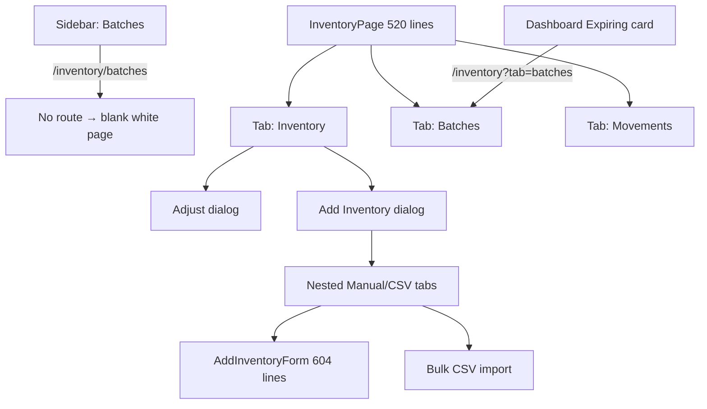
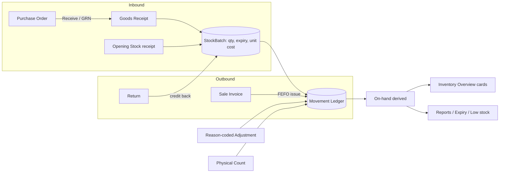
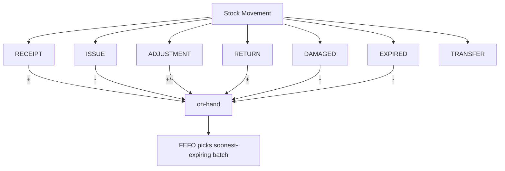
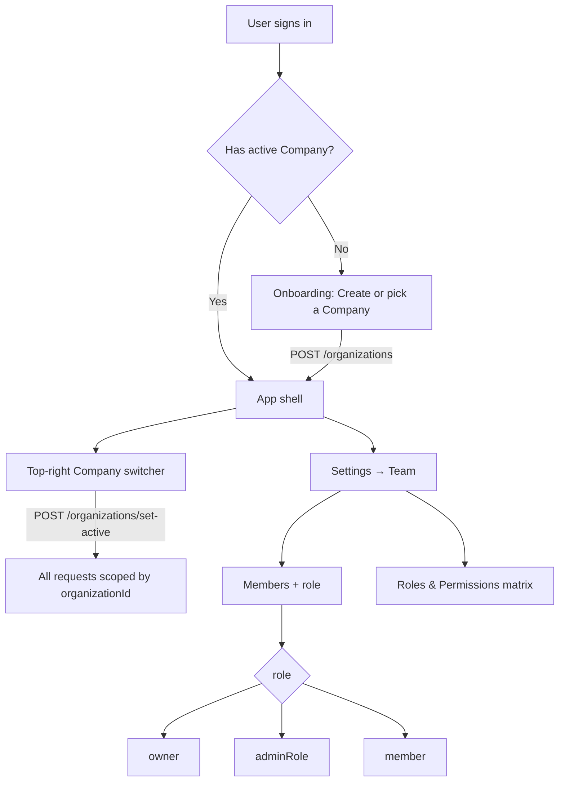

# Stock & User Flow — Reference-App Research

**Date:** 2026-10-09
**Purpose:** ground the redesign of the DMS stock and team/company flows in how established
distribution/ERP products actually model them. Produced in response to "the stock and user
flow is not good — research how others did it."

**Sources** (see §7): Odoo Inventory docs, ERPNext Stock docs + source, Zoho Inventory API/user
guides, InvenTree docs, CIN7/Dear API.

---

## 1. How established apps do it

### Odoo Inventory (the closest analogue)
- The **Inventory app opens on an Overview dashboard of kanban cards** — "Receipts to process",
  "Delivery orders", "Internal transfers", etc. — one glance, one click into the work.
- **Operations are typed but share one document**: a receipt, a delivery, and an internal
  transfer are all *pickings* distinguished by type. There is no separate "Add Inventory" form.
- **Inbound is a Goods Receipt created from a Purchase Order** (a smart button on the PO), then
  *Validated*. One-step or two-step receiving is a configuration choice.
- **Expiry/lots** are a per-product tracking mode (lot/serial). Per product you configure
  `Expiration Time`, `Best Before Time`, `Removal Time`, and `Alert Time`; the system computes the
  expiry date on receipt, runs **FEFO**, and raises expiry alerts/notifications.
- **Multi-company:** a company selector in the top-right header (checkbox multi-select, one active);
  each user has *Allowed Companies* and a *Default Company*; records are either company-specific or
  shared (blank company = all). This is precisely the agency model we chose (ADR 0004).

### ERPNext
- **One `Stock Entry` document with a `purpose`:** Material Receipt, Material Issue, Material
  Transfer, Manufacture, Repack, Scrap. Everything that moves stock is a typed Stock Entry.
  Purchase Receipt / Delivery Note are the buy/sell flows; Stock Entry is the catch-all.
- **Stock Ledger + Stock Balance** reports; on-hand is projected from the ledger.
- **Batch** is its own record with `expiry_date`, `manufacturing_date`, and a configurable naming
  series (`autoname: field:batch_id`). Batch-only fields are hidden unless the item is batch-tracked.
- **Over-receipt / over-delivery limits** with a *role allowed to exceed* — the exact shape of our
  credit-limit soft-block decision (ADR 0005).
- **Freeze Stock Entries** prevents posting before a date / editing old entries, with a role that
  can override. Negative stock is optionally allowed (not for serial/batched items).
- Permissions are per-doctype per-role; **Company is a document field reused across transactions.**

### Zoho Inventory / ERP
- Modules are explicit: **Items, Inventory Adjustments, Transfer Orders, Packages, Shipments,
  Purchase Receives, Batches/Serial Numbers.**
- **Adjustments** sync stock for theft/damage/error — they carry a **reason (+ reason_id)** and,
  on positive adjustments, a batch manufacture/expiry date. Adjusting is a document, not a form field.
- **Transfer Orders:** from/to location, with *Initiate Transfer* (In Transit, receive later) vs
  *Transfer and Receive* (instant), plus an **optional approval workflow**.

### InvenTree (open source, ~7.6k stars)
- **Part** (catalog) vs **Stock Item** (a physical quantity of a Part at a **Location**, optionally
  with a **batch code** and serial). Locations form a cascading hierarchy.
- **Every adjustment auto-creates a typed Stock Tracking entry** — user, date, quantity delta, and
  an event type (created, edited, counted, manually added/removed, returned to stock, shipped
  against SO, received against PO, returned against RO…). Entries survive item deletion.
- Stated design philosophy: *"Updating stock is a single-action process and does not require a
  complex system of work orders or stock transactions."*

### CIN7 / Dear
- Stock Adjustments and Stock Transfers are first-class documents that can be **voided/undone**
  (`varVoid`), not deleted — reversibility is built into the model.

---

## 2. Patterns worth copying

| # | Pattern | Why |
|---|---|---|
| A | **On-hand is derived, never edited** — all changes are typed movements in a ledger | auditability; matches DMS's `InventoryLog` |
| B | **Inbound = Goods Receipt against a Purchase** (capture batch, expiry, unit cost there) | one inbound path, not a generic "add stock" form |
| C | **One typed transaction for the rest** (receipt / issue / transfer / adjustment / scrap / count) | avoids N bespoke dialogs |
| D | **Adjustments are reason-coded documents** (theft, damage, count variance, expiry) | matches Zoho/ERPNext |
| E | **Batch/expiry is a tracking mode**, surfaced as a lot list + FEFO + alerts | matches DMS `StockBatch` + FEFO |
| F | **Physical count is its own workflow** with freeze + variance | prevents silent overwrites |
| G | **Dashboard = kanban of work-to-do**, not just charts | Odoo's overview |
| H | **Flat, task-oriented navigation** (Inventory → Overview / Products / Stock / Batches / Movements) | today's 3-tab page nests tabs |
| I | **Multi-company = top-right switcher + per-user allowed/default company; records scoped by company** | exactly ADR 0004 |
| J | **Over-limit operations need a permission** (over-receive, edit frozen, etc.) | exactly ADR 0005 credit soft-block |
| K | **Reversible documents (void), not hard deletes** | matches DMS soft-delete/restore |

---

## 3. How DMS differs today (the friction)

- `InventoryPage` is a **520-line three-tab mega-page** (Inventory / Batches / Movements).
- The **Add Inventory dialog nests its own Manual/CSV tabs inside the dialog's Manual/CSV toggle**
  (`AddInventoryDialog` → `AddInventoryForm`) — duplicated, confusing.
- **Batches has no route** — it is a sub-tab, but the sidebar links to `/inventory/batches`, so the
  menu item produces a blank page (no catch-all route).
- **Inbound is a loose "Add Inventory" form**, not tied to a purchase receipt; batch/expiry/cost
  entry is split across Add/Adjust dialogs.
- **Adjustments** are a single +/- dialog with a free-text reason; no typed reason, no count workflow.
- **No company switcher / create UI**; hard-blocked when an org is missing.
- **Team page calls a non-existent `/api/users` router**; the real member API is unused.

---

## 4. Proposed DMS stock flow

Keep DMS's simpler scope (single location; batch/FEFO already exists) but adopt patterns A–H:

- **Inventory group in the sidebar:** Overview (work cards) · Products · Stock on-hand · Batches &
  Expiry · Movements · Adjustments.
- **Inbound:** Purchases → *Receive* creates a `StockBatch` (qty, expiry, unit cost). "Add Inventory"
  becomes "Receive Stock", optionally against a PO; opening stock is a typed receipt.
- **Adjustments:** one reason-coded dialog (Spoilage / Breakage / Count variance / Theft / Expired),
  no nested tabs.
- **Batches & Expiry:** dedicated page (fixes the blank route) with an expiry-window filter that
  *excludes already-expired* rows, FEFO state, and skeleton/error states.
- **Movements:** the existing ledger, now the single source of truth surfaced directly.

### 4.1 Current flow (broken/duplicated)

### 4.2 Reference-style proposed flow

### 4.3 Movement model (one typed entry, like ERPNext Stock Entry)

---

## 5. Multi-company & team (Odoo model, applied to DMS)

**Team flow to build:** `UsersPage`/`UserDialog` rewired to
`GET/POST /api/organizations/:id/members` + `DELETE/PATCH /api/members/:id` (the tested API that
already exists), with role options limited to `member | owner | adminRole`. Over-limit sale creation
gated by a `sales.override_credit_limit` permission (pattern J).

---

## 6. What to adopt vs defer

**Adopt now:** typed movements surfaced in a flat Inventory nav; Receive-Stock-tied-to-Purchase;
reason-coded adjustments; dedicated Batches page; company create/switch; member-based Team page.

**Defer:** multi-warehouse/location hierarchy (out of scope per PRD §6); physical-count freeze
workflow (nice-to-have); transfer orders (single location today); negative stock (DMS refuses
below-zero per glossary, which is correct here).

---

## 7. Sources

- Odoo — Inventory overview & receipts: `odoo.com/documentation/17.0/applications/inventory_and_mrp.html`
- Odoo — Expiration dates / FEFO: `odoo.com/documentation/18.0/applications/inventory_and_mrp/inventory/product_management/product_tracking/expiration_dates.html`
- Odoo — Multi-company & company selector: `odoo.com/documentation/18.0/applications/general/companies/multi_company.html`
- Odoo — Users & multi-company access: `odoo.com/documentation/19.0/applications/general/users.html`
- ERPNext — Stock Entry / purposes: `goerpnext.com/docs/erpnext/stock/stock-entry`
- ERPNext — Stock Settings (over-receipt, freeze): `goerpnext.com/docs/erpnext/stock/stock-settings`
- ERPNext — Batch doctype: `github.com/frappe/erpnext/blob/develop/erpnext/stock/doctype/batch/batch.json`
- Zoho Inventory — Adjustments (`zoho.com/erp/api/v3/inventoryadjustments`), Transfer Orders (`zoho.com/inventory/help/warehouses/transfer-orders.html`)
- InvenTree — Stock Items & Tracking: `docs.inventree.org/en/latest/stock/tracking`, `docs.inventree.org/en/stable/stock/`
- InvenTree — repo philosophy: `github.com/inventree/InvenTree`
- CIN7 / Dear — Stock API (void/undo): `github.com/FalconEyeSolutions/CIN7-DearInventory/blob/main/docs/StockApi.md`
